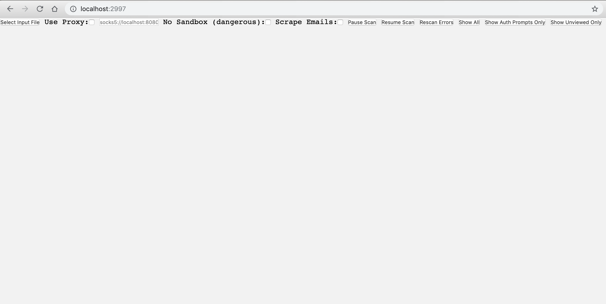
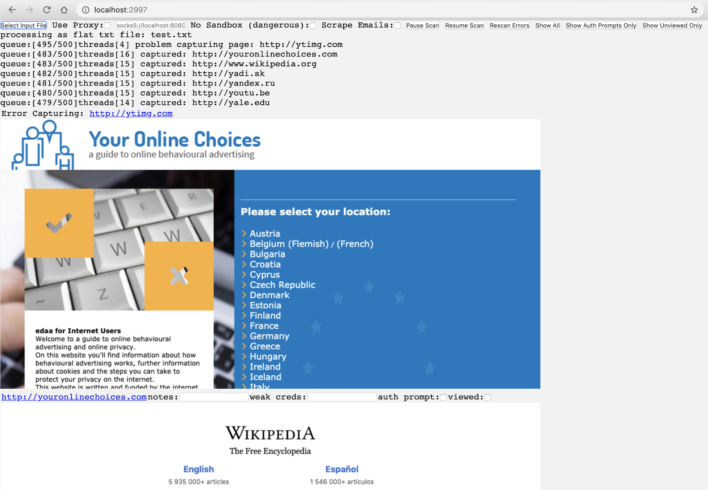

Snapback
============
Snapback is a HTTP(s) screenshot tool written to take advantage of asynchronous threading in Nodejs. It's like EyeWitness, gowitness, and rawr, etc. but generally faster, and compatible with MacOS, Windows, and Linux.

Installation 
============
You will need to install Node and NPM (Node Package Manager) to run the project.
I recommend running this tool on the native OS, but it works fine on a VM as well. I have tested on a Kali VM after the basic apt-get install of node and npm without issues. It has also been tested on a Win7 VM with a standard Node.js install.
To install dependencies:

```
git clone https://git.issgs.net/fkasler/snapback.git
cd snapback
npm install
```

That's it. Now you're ready to start collecting screenshots

Usage
=====

```
node snapback.js 
```


Then navigate to http://localhost:2997 and click the "Select Input File" to start taking screenshots. Snapback currently supports .nessus files, nmap .xml files, ScopeCreep exports, and .txt files with one target url per line.




This should kick off the scan and should give you screens and html data in a folder called "report".



The "report" folder is created by the tool if it does not exist. To start a new scan/project simply move or remove the "report" folder, restart the server side ("node snapback.js"), and refresh the web GUI.

You can also use a socks5 or HTTP proxy by checking the "Use Proxy" box and specifying the proxy location. For example, to scan through a remote box over port 8080, set up the proxy with:

```
ssh username@remote.server.com -D 8080
```

Then add "socks5://localhost:8080" as your proxy setting in Snapback.

The "Delay" setting allows the user to set a number of seconds to wait, after intial page load events, before taking the screenshot. This can be useful when services are rendering slowly.

The "No Sandbox" setting is just to get around restrictions running the headless browser as root. It is really only useful for running the tool on Kali Linux or similar without needing to jump through a bunch of hoops.

Report checkboxes are saved automatically. Report notes are saved on "focusout" so just click outside of the input and your notes will be saved. The notes feature is meant to keep track of default/weak creds you find.

A cool use case for this tool is data mining. Because the HTML of each page is saved in your report folder, you can create a .txt input file of pages to scrape and then use a little grep/sed/vim foo to get the data you want from each page of HTML. I found myself mining a lot of emails using this method so I went ahead and built it into the tool. Just check the 'scrape emails' checkbox before scanning and the tool will run some JavaScript on each page to do an email regex search. Results are stored in a file called 'emails.txt' in your report folder.

Don't like the web UI? Prefer to live in the CLI? No problem! You can specify an input file from the command line like so:

```
node snapback.js /full/path/to/my/input_file.nessus
```

Want to use a proxy from the CLI? Just specify the proxy as an additional argument after your input file:

```
node snapback.js /full/path/to/my/input_file.nessus socks5://localhost:8080
```

Reporting
=====
To export just a .zip with a copy of your sqlite database and screenshots that might be pulled into a report (auth prompts and weak creds), you can use the "Report Export" button. The .zip will be stored in your Snapback project root.

The database is only a single table "services" with the following structure:


**url** TEXT NOT NULL UNIQUE - the URL of the image

**image_path** TEXT - the file path to the captured image relative to the snapback project root

**image_hash** TEXT - md5 hash of the captured image for fingerprinting/grouping

**text_path** TEXT - path to the html of the captured page relative to the snapback project root

**text_hash** TEXT - md5 hash of the captured html for fingerprinting/grouping

**text_size** INTEGER - RESERVERD BUT NOT USED YET for  fingerprinting/grouping

**captured** INTEGER - 1 == Captured, 0 == Not Captured

**error** INTEGER - 1 == Error Capturing, 0 == No Error Capturing (yet... may not have run against this URL)

**viewed** INTEGER - 1 == Viewed, 0 == Not Viewed

**default_creds** TEXT - Used to record default creds that the user finds

**auth_prompt** INTEGER - 1 == There is an auth prompt on the page, 0 == No auth prompt detected

**notes** TEXT - Used to record device type or other notes for further testing/investigation

Happy Hacking :)
